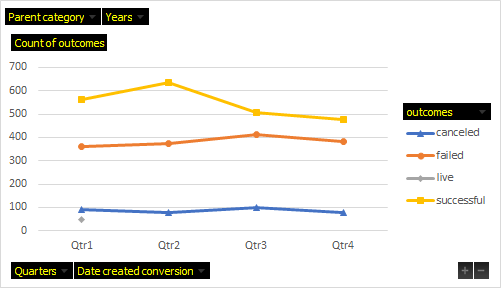
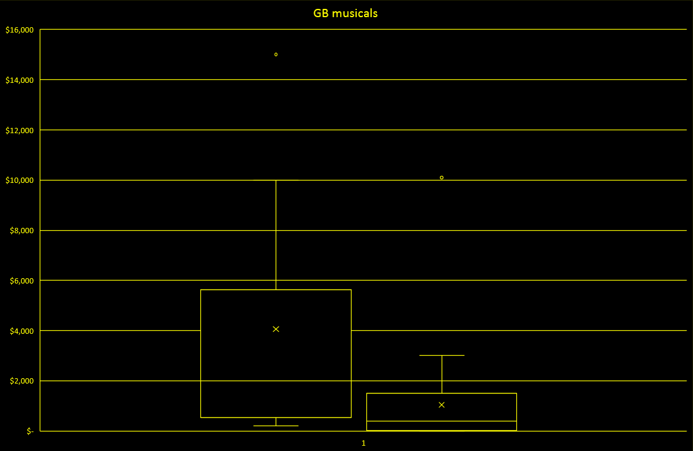
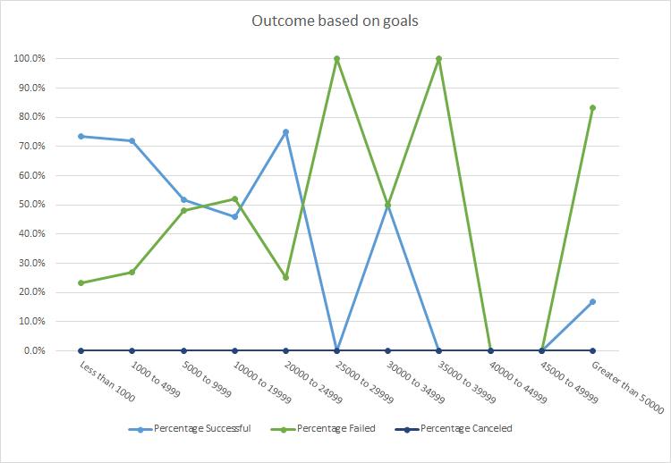
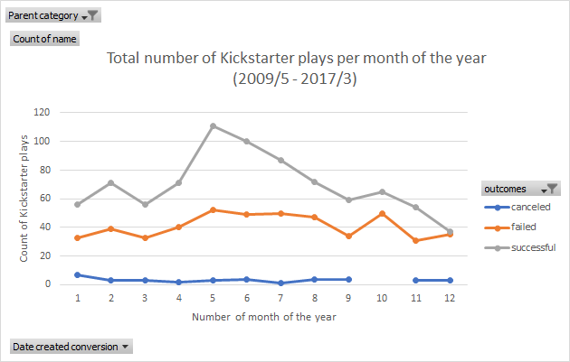

# An Analysis of Kickstarter Campaigns
##Performing analysis on Kickstarter data to uncover trends

### Kick start: Theatrical productions in US

Findings:

* In the Kickstarter campaigns dataset 3,038 out of around 4000 campaings are from the U.S. From these, 525 are sucessful theater campaigns.

Theater looks like the most popular and successful type of campaign overall (see following plot). 

June shows a noticeable big number of successful campains, which decreases by December. Successful Kickstarter campaigns started in May-June. December seems to be the worst month to launch a campaign.

Asking for twice of the average successful Kickstarter goal is not recommended; there are failed Kickstarter campaigns with very high goals and the data tells us that it is possible that such is the reason why they failed.

### Kick start: Theatrical productions in GB (there is interest to start a pfoject with an estimated budget of £4,000.)

* In Great Britain there are 604 Kickstarter theatre play campaigns, being that subcategory the most successful.
* "Foresight" (Great Britain play): Its campaign was a successful one and it was active for about a month. It reached 100% of its goal. 
  Despite having only 17 backers, tt shows a high donation's average value. 
  
* With a boxplot we compared the distribution of campaign goals and the distribution of total amounts pledged for plays in Great Britain.
 

We show that the mean campaign goal is close to £4,000 (boxplot in the left side). This is outside of the range of outliers for amount pledged, It is recommended to produce the theatrical play for less than £4,000 since half of the campaign goals are less than £2,000 (boxplot in the right side).

### Challenge

Here we want to know how many other Kickstarter campaigns were able to came close to its fundraising goal.
Also we want to determine whether the length of a campaign contributes to its ultimate success or failure.

First we did an analysis of outcome based on goals, using data only from the "Theatre/Play" subcategory.

In this plot we can see that there is a trend on goals and success of a kickstarter campaign. Sucessful campaigns with higher goals are very few, specially above $40000. In average, 63.6% campaigns with goals up to $24999 succeeded. In total, 554 play campaigns succeeded in achieving their goal.

Next we have the following plot:

This plot indicates that the number of successful campaigns peak on June and decrease on December. However the number of failed campaigns dont seem to change much. The length of the campaign doesnt seem to hint chances of succeeding or failing.

